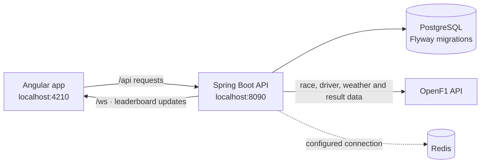

<div align="center">

# F1 Strategy Simulator

**Every stint is a bet on degradation.**

Build a tyre strategy, simulate its predicted race time, and see how it compares with a real result.

[](https://openjdk.org/projects/jdk/21/)
[](https://spring.io/projects/spring-boot)
[](https://angular.dev/)
[](https://www.postgresql.org/)

</div>

## Navigate

| [🏎️ Overview](#overview) | [🚦 Quick start](#quick-start) | [🎮 Use the simulator](#use-the-simulator) | [⚙️ Configuration](#configuration) | [🧭 Architecture](#architecture) | [🛠️ Troubleshooting](#troubleshooting) | [🤝 Contributing](#contributing) |
| --- | --- | --- | --- | --- | --- | --- |

## Overview

An F1 strategy sandbox powered by real race, driver, weather, and result data from [OpenF1](https://openf1.org/). Pick a race, plan tyre stints, and compare a simulation with a driver's actual race time when results are available.

| Feature | What you can do |
| --- | --- |
| **Strategy builder** | Choose Soft, Medium, Hard, Intermediate, or Wet tyres; edit stint lap ranges; simulate a full race distance. |
| **Race explorer** | Browse synced races and drivers alongside locally bundled circuit outlines. |
| **Race context** | View synced weather windows and compare predictions against available race results. |
| **Leaderboard** | Compare each user's closest scored prediction by circuit; receive live updates over WebSocket. |
| **Accounts** | Register and sign in to save and score simulations. |

> [!NOTE]
> The strategy engine is an estimate, not a race-pace predictor: tyre degradation is linear, and safety cars, red flags, and other race incidents are not modeled.

## Quick start

### Prerequisites

- Docker Engine with Docker Compose
- Node.js and npm

### Start the app

From the repository root, start PostgreSQL, Redis, and the API:

```sh
docker compose up --build -d
```

In a second terminal, start the Angular development server:

```sh
cd frontend
npm ci
npm start
```

Open [http://localhost:4210](http://localhost:4210), register or sign in, then choose a circuit and driver. The API listens on `http://localhost:8090`; its [Swagger UI](http://localhost:8090/swagger-ui.html) lists the available endpoints.

<details>
<summary>First run: import a race season</summary>

A new database has no races until you sync data from OpenF1. Sign in in the app, then copy your token from the browser developer console:

```js
localStorage.getItem('f1sim_token')
```

Use that token in this authenticated request, replacing `<JWT>` with the copied value:

```sh
curl -X POST "http://localhost:8090/api/admin/sync/season/2024" \
  -H "Authorization: Bearer <JWT>"
```

Change `2024` to the season to import. OpenF1 availability and request limits apply. Race synchronization is a manual request; the backend's scheduled job scores simulations when results for finished races become available.

</details>

## Use the simulator

1. Choose a circuit and select an available race and driver.
2. Sign in and select **Build a strategy**.
3. Add or remove stints, select a compound, and set the lap range. Cover the full race distance.
4. Select **Run simulation** to see predicted total time and, for a finished race with results, the delta from actual time.
5. Visit **Leaderboard** to view the closest scored prediction per user and circuit.

<details>
<summary>What the model includes</summary>

Each lap combines a base time, tyre-compound pace delta, linearly increasing stint degradation, and a penalty when tyre choice mismatches wet or dry conditions. Each pit stop adds circuit pit-lane loss and the team's average stop time. The engine is implemented in [`StrategyEngineService`](backend/src/main/java/com/f1sim/service/StrategyEngineService.java).

</details>

## Configuration

Compose provides local PostgreSQL and Redis services. The backend configuration in [`application.yml`](backend/src/main/resources/application.yml) supports:

| Variable | Purpose | Default |
| --- | --- | --- |
| `SPRING_DATASOURCE_URL` | PostgreSQL connection URL | `jdbc:postgresql://localhost:5435/f1sim` |
| `DB_USERNAME` / `DB_PASSWORD` | Database credentials | `f1sim` / `f1sim` |
| `REDIS_HOST` / `REDIS_PORT` | Redis connection | `localhost` / `6381` |
| `JWT_SECRET` | JWT signing secret | Development placeholder |

Set a strong `JWT_SECRET` and non-development database credentials before exposing the service beyond a local environment. In Compose, the backend connects to the database and Redis using their service names and internal ports.

<details>
<summary>Local service URLs and ports</summary>

| Service | Address | Notes |
| --- | --- | --- |
| Angular frontend | [localhost:4210](http://localhost:4210) | API requests under `/api` are proxied to the backend. |
| Spring Boot API | [localhost:8090](http://localhost:8090) | Swagger UI: [`/swagger-ui.html`](http://localhost:8090/swagger-ui.html). |
| PostgreSQL | `localhost:5435` | Compose service `db`; data persists in `f1sim-db-data`. |
| Redis | `localhost:6381` | Compose service `redis`. |

Stop the containers with `docker compose down` from the repository root.

</details>

## Architecture



| Area | Location | Responsibility |
| --- | --- | --- |
| Frontend | [`frontend/src/app`](frontend/src/app/) | Lazy-loaded Angular screens, API clients, auth, and local circuit-track data. |
| REST API | [`backend/src/main/java/com/f1sim/controller`](backend/src/main/java/com/f1sim/controller/) | Race, circuit, auth, strategy, leaderboard, and manual sync endpoints. |
| Services | [`backend/src/main/java/com/f1sim/service`](backend/src/main/java/com/f1sim/service/) | OpenF1 ingestion, strategy simulation, race-result scoring, and weather/incident sync. |
| Database | [`backend/src/main/resources/db/migration`](backend/src/main/resources/db/migration/) | PostgreSQL schema migrations managed by Flyway. |
| Local services | [`docker-compose.yml`](docker-compose.yml) | PostgreSQL, Redis, and the containerized backend. |

<details>
<summary>API at a glance</summary>

| Method | Endpoint | Access |
| --- | --- | --- |
| `POST` | `/api/auth/register`, `/api/auth/login` | Public |
| `GET` | `/api/races`, `/api/races/{id}`, `/api/races/{id}/drivers`, `/api/races/{id}/weather` | Public |
| `GET` | `/api/circuits`, `/api/leaderboard?circuitId={id}` | Public |
| `POST` | `/api/strategy/simulate` | Sign-in required |
| `POST` | `/api/admin/sync/season/{year}` | Sign-in required |
| WebSocket | `/ws` → `/topic/leaderboard/{circuitId}` | Live leaderboard updates |

</details>

### Project structure

```text
.
├── backend/      Spring Boot API, Flyway migrations, Dockerfile
├── frontend/     Angular app, circuit data, UI components
└── docker-compose.yml
```

## Troubleshooting

<details>
<summary>The race list is empty</summary>

Sync a season using the authenticated request under [Quick start](#quick-start). Confirm OpenF1 has data for that season and check the backend logs with `docker compose logs backend`.

</details>

<details>
<summary>The frontend cannot reach the API</summary>

Confirm the frontend runs on port `4210` and the Compose backend on `8090`. The development server's `/api` proxy target is configured in [`proxy.conf.json`](frontend/proxy.conf.json). Inspect service startup with `docker compose logs backend db redis`.

</details>

<details>
<summary>Database connection or schema errors</summary>

Check `docker compose logs db backend` and ensure PostgreSQL is ready. Flyway applies migrations on backend startup; avoid manually changing the schema managed by those migrations.

</details>

## Contributing

Bug reports and focused pull requests are welcome. For significant behavior changes, open an issue first. Include reproduction steps for bug fixes and note how you verified your change.

## Project status and license

The repository includes race browsing, account registration and login, strategy simulation, and circuit leaderboards. No hosted deployment or `LICENSE` file is currently documented; no usage or distribution permissions are specified.
